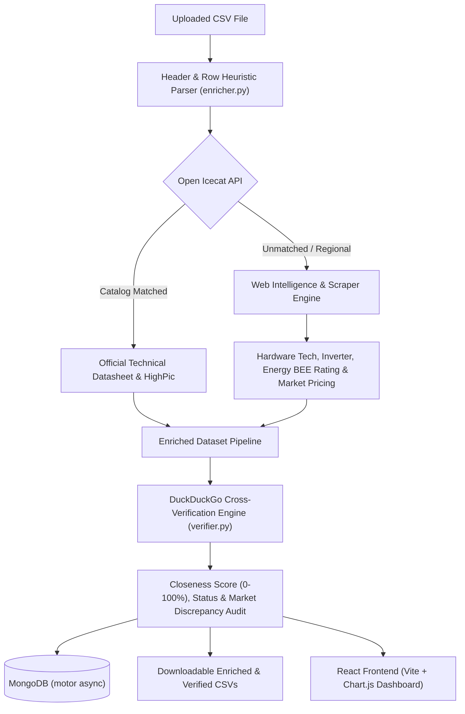

# CSV Analyser & Product Intelligence Platform - Master Documentation

A production-grade, full-stack AI & catalog intelligence platform built to enrich, cross-verify, analyze, and visualize consumer electronics and appliance datasets.

---

## 1. Architecture & Data Flow



---

## 2. Technology Stack & Library Reference

### Backend Technologies (Python 3.10+)
| Package / Library | Version | Purpose |
|---|---|---|
| **FastAPI** | `^0.115.0` | High-performance asynchronous REST API framework |
| **Uvicorn** | `^0.32.0` | Lightning-fast ASGI web server implementation |
| **Motor** | `^3.6.0` | Asynchronous non-blocking Python driver for MongoDB |
| **Pydantic / Pydantic-Settings** | `^2.9.0` | Data validation, type enforcement, and environment settings |
| **Pandas** | `^2.2.0` | High-performance data manipulation, header deduplication, and CSV export |
| **HTTPX** | `^0.28.0` | Next-generation async HTTP client for external API requests |
| **BeautifulSoup4** | `^4.12.0` | HTML document parsing for web scraper extraction |
| **Python-Multipart** | `^0.0.12` | Streaming file uploads and multipart form handling |
| **OpenAPI / Swagger** | `Built-in` | Interactive documentation schema at `/docs` and `/openapi.json` |

### Frontend Technologies (React 18 + Vite)
| Package / Library | Version | Purpose |
|---|---|---|
| **React & React-DOM** | `^19.0.0` | Component-based reactive UI library |
| **Vite** | `^6.0.0` | Ultra-fast build tool and local dev server |
| **Lucide React** | `^0.460.0` | Premium, lightweight vector iconography |
| **Chart.js** | `^4.4.0` | Responsive HTML5 canvas data visualization |
| **React-ChartJS-2** | `^5.2.0` | React wrapper for Chart.js components |
| **Axios** | `^1.7.0` | Promise-based HTTP client for REST API communication |
| **Vanilla CSS** | `Custom` | Modern glassmorphic dark theme, responsive flex/grid design system |

### Database & Storage
- **MongoDB**: Async document store for dataset summaries, match rates, and verification audit history.
- **Local File System**: `backend/uploads/` storage for raw, enriched, and verified CSV exports.

---

## 3. Directory Structure

```text
csv analyser/
├── backend/
│   ├── app/
│   │   ├── core/
│   │   │   └── config.py              # Pydantic Settings & environment variables
│   │   ├── db/
│   │   │   └── repositories/          # MongoDB dataset repository operations
│   │   ├── routes/
│   │   │   ├── csv.py                 # CSV upload, enrich, verify, & download routes
│   │   │   ├── health.py              # Health check and probes
│   │   │   └── database_routes.py     # MongoDB stats & collections routes
│   │   ├── schemas/
│   │   │   ├── enrichment_schema.py   # Pydantic schemas for enrichment
│   │   │   └── verification_schema.py # Pydantic schemas for web verification
│   │   └── services/
│   │       ├── enricher.py            # Hybrid Icecat + Web Scraper engine
│   │       ├── verifier.py            # DuckDuckGo closeness scoring engine
│   │       ├── icecat.py              # Open Icecat live API connector
│   │       └── csv_service.py         # CSV file handling, filtering, & caching
│   ├── uploads/                       # Saved CSV artifacts directory
│   ├── .env                           # Environment secrets and connection URI
│   ├── .env.example                   # Environment template
│   ├── main.py                        # FastAPI application entrypoint with lifespan
│   ├── run.py                         # Dev runner with Uvicorn reload
│   ├── test_api.py                    # Complete automated verification test suite
│   ├── generate_swagger.py            # Script to export OpenAPI specification
│   └── requirements.txt               # Backend Python dependencies
│
├── frontend/
│   ├── public/                        # Static public assets
│   ├── src/
│   │   ├── components/
│   │   │   ├── Header.jsx             # Navigation bar & system health badge
│   │   │   ├── UploadHero.jsx         # Drag-and-drop ingestion & sample loader
│   │   │   ├── EnrichedDataView.jsx   # Data table with images, pricing, & sources
│   │   │   ├── AnalyticsDashboard.jsx # KPI cards, charts, & row correctness audit
│   │   │   ├── ProductModal.jsx       # Full-screen spec sheet & citation inspector
│   │   │   └── HistoryDrawer.jsx      # MongoDB uploaded datasets history drawer
│   │   ├── services/
│   │   │   └── api.js                 # Axios API connector
│   │   ├── App.jsx                    # Root application controller & state
│   │   ├── main.jsx                   # React DOM render entry
│   │   └── index.css                  # Custom design tokens, glassmorphism & styles
│   ├── index.html                     # HTML5 template with Google Fonts (Inter & Outfit)
│   ├── vite.config.js                 # Vite configuration with /api backend proxy
│   └── package.json                   # Frontend dependencies & scripts
│
└── PROJECT_DOCUMENTATION.md           # Master Documentation
```

---

## 4. Environment Variables (`.env`)

Create `backend/.env` with the following configuration:

```ini
# Application Configuration
APP_NAME="CSV Analyser & Product Intelligence Platform"
ENVIRONMENT="development"
DEBUG=True
PORT=8000
HOST="127.0.0.1"

# MongoDB Database Configuration
MONGODB_URI="mongodb://localhost:27017"
MONGODB_DB_NAME="csv_analyser"

# Open Icecat Live API Configuration
ICECAT_BASE_URL="https://live.icecat.biz/api/"
ICECAT_SHOP_NAME="openicecat-live"
ICECAT_LANG="en"

# CORS Allowed Origins
CORS_ORIGINS=["http://localhost:5173", "http://localhost:5174", "http://127.0.0.1:5173", "http://127.0.0.1:5174"]

# Upload Directory
UPLOAD_DIR="uploads"
MAX_UPLOAD_SIZE_MB=50
```

---

## 5. Unified 1-Command Startup (Recommended)

From the project root folder (`csv analyser/`), run **any** of the following single commands to start both the **FastAPI Backend** and the **React Frontend** simultaneously:

```powershell
# Option 1: Python unified runner (Cross-platform)
python start.py

# Option 2: NPM script
npm start
# or:
npm run dev

# Option 3: Windows Batch (or double-click start.bat in File Explorer)
.\start.bat

# Option 4: PowerShell script
.\start.ps1
```

> [!TIP]
> **Press `Ctrl + C`** in your terminal at any time to gracefully terminate both the backend and frontend servers together.

---

## 6. Manual Individual Server Commands

Navigate to the `backend/` folder:
```powershell
cd "c:\Users\HP\OneDrive\Desktop\project sona\csv analyser\backend"
```

1. **Create & Activate Virtual Environment**:
   ```powershell
   python -m venv venv
   .\venv\Scripts\Activate.ps1
   ```

2. **Install Backend Dependencies**:
   ```powershell
   pip install -r requirements.txt
   ```

3. **Start the FastAPI Backend Server**:
   ```powershell
   python run.py
   # Or using uvicorn directly:
   uvicorn main:app --host 127.0.0.1 --port 8000 --reload
   ```

4. **Run the Full Automated Test Suite**:
   ```powershell
   python test_api.py
   ```

5. **Regenerate Swagger OpenAPI JSON (`openapi.json`)**:
   ```powershell
   python generate_swagger.py
   ```

---

### B. Frontend Setup & Run Commands

Navigate to the `frontend/` folder:
```powershell
cd "c:\Users\HP\OneDrive\Desktop\project sona\csv analyser\frontend"
```

1. **Install Frontend Dependencies**:
   ```powershell
   npm install
   ```

2. **Start the Vite Frontend Development Server**:
   ```powershell
   npm run dev
   # Opens at: http://localhost:5174/ (or 5173)
   ```

3. **Build the Production Bundle**:
   ```powershell
   npm run build
   ```

4. **Preview Production Build Locally**:
   ```powershell
   npm run preview
   ```

---

## 6. Pipeline Features & Capabilities

### Feature 1: Header Deduplication & Multi-Word Identification
- Automatically resolves duplicate columns like `manufactu,manufactu,brand,description` to unique references.
- Content-aware extraction identifies Brand, Model Number, and Variant attributes regardless of header naming.

### Feature 2: Hybrid Open Icecat + Web Intelligence Engine
- **Open Icecat**: Queries live catalog for verified manufacturer datasheets.
- **Web Intelligence Scraper**: Extracts real market titles, categories, compressor/inverter tech, 5-Star BEE energy ratings, and pricing for regional domestic appliances.

### Feature 3: DuckDuckGo Live Verification & Closeness Scoring
- Audits each record against live Google/DuckDuckGo search results.
- Generates a **Closeness Score (0 - 100%)** measuring data fidelity.
- Computes dataset accuracy grades: `A+ (Flawless)`, `A (High)`, `B (Moderate)`.

### Feature 4: High-Resolution Product Image Resolution
- Provides direct CDN imagery for all major consumer electronics & appliance categories with client-side fallback resolvers.

### Feature 5: Individual Record Correctness & Citation Links
- The Analytics Dashboard displays row-by-row correctness meters and specific validation checks (Brand Match, Model Code Match, Specifications Match).
- The Enhanced Data table includes direct clickable citation links to live search queries and datasheets.

---

## 7. REST API Reference

### `POST /api/csv/enrich`
Enriches an uploaded CSV with Open Icecat data, technical specifications, dynamic pricing, and product images.
- **Input**: `multipart/form-data` with `file: UploadFile`
- **Output**: JSON `EnrichmentSummary` with preview rows and download URL.

### `POST /api/csv/verify`
Cross-verifies CSV products against live DuckDuckGo index data, calculating closeness scores and generating discrepancy reports.
- **Input**: `multipart/form-data` with `file: UploadFile`
- **Output**: JSON `VerificationResponse` with dataset insights.

### `POST /api/csv/verify/single`
Instant single-product verification probe.
- **Input**: `{"brand": "Samsung", "model_code": "AR18CY5A", "description": "1.5 Ton AC"}`
- **Output**: `{"closeness_percentage": 100.0, "verification_status": "VERIFIED_HIGH_CONFIDENCE", ...}`

### `GET /api/csv/{file_id}/download-enriched`
Downloads the enriched CSV file with complete technical parameters.

### `GET /api/csv/{file_id}/download-verified`
Downloads the verified CSV file with closeness scores, status, and verification notes.

### `GET /api/csv/datasets`
Retrieves past uploaded datasets history from MongoDB.

### `GET /api/csv/{file_id}/preview`
Fetches paginated records for an active dataset.

### `DELETE /api/csv/{file_id}`
Deletes a dataset from disk and MongoDB.

### `GET /health`
Returns system health, uptime, disk space, and MongoDB connectivity.

---

## 8. Troubleshooting & FAQ

| Problem | Cause | Solution |
|---|---|---|
| **MongoDB connection fails** | MongoDB service is stopped or port `27017` is blocked | Ensure MongoDB Community Server is started (`mongod` or via Windows Services) |
| **Vite port in use** | Another dev server is running on port `5173` | Vite automatically selects port `5174` (or configure `port: 5173` in `vite.config.js`) |
| **Broken image thumbnails** | Third-party image CDN blocked or deprecated | Handled automatically by the built-in `resolveProductImage` fallback resolver |
| **Windows console Unicode error** | Console encoding lacks character set | The test suite and backend use ASCII-safe encoding for currency symbols |
